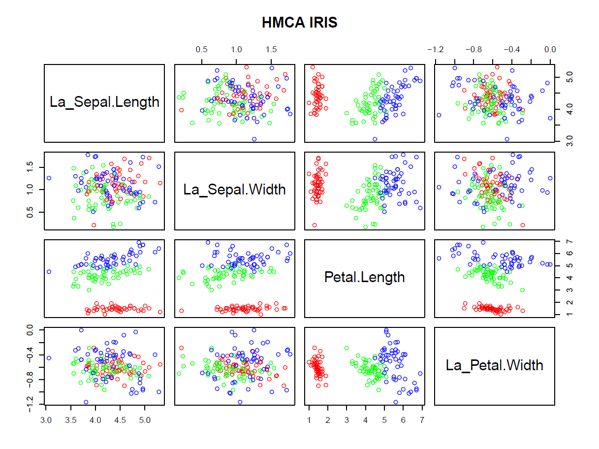
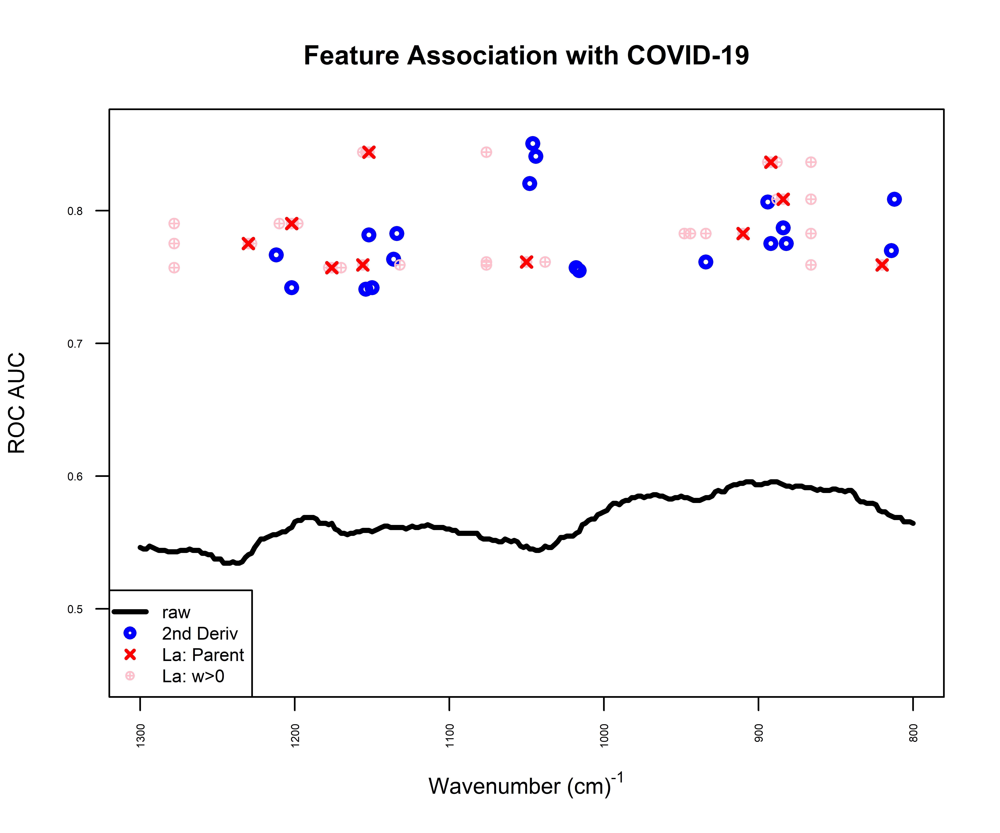
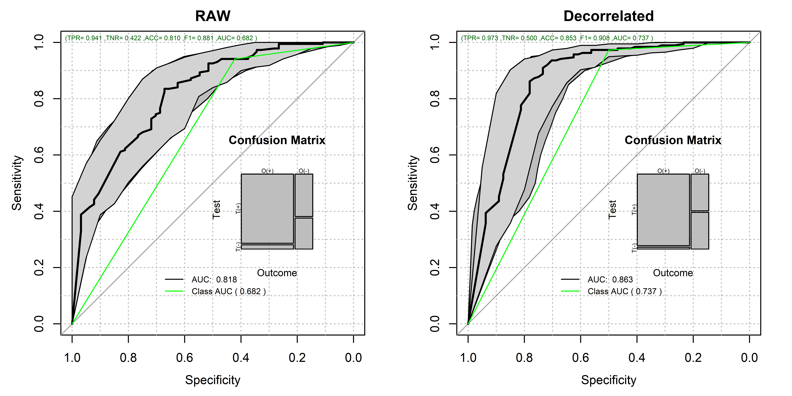

# Latent Biomarker Discovery

This repository showcase the use of the **FRESA.CAD::GDSTMDecorrelation()** and the **FRESA.CAD::getLatentCoefficients()** for the discovery of Latent Biomarkers from tabular data-sets.

In many biomarker-discovery studies, a large set of measurements and variables are recorded aiming to find surrogate markers of disease stage or markers of therapeutical efficiency (i.e., the biomarker). In many cases, simple feature selection approaches are enough to discover the relevant variables associated with the desired outcome, but in many cases, these simple approaches fail to return a simple set of features or fail to discover a strong candidate with clinical utility. The issue is mainly present when a large set of these measurements are correlated hence cluttering the discovery process. This repository shows how to use the FRESA.CAD R package to decorrelate the data features and extract a set of Latent biomarkers that may be used as alternative markers.

Simple use:

```{r}
library("FRESA.CAD")
data('iris')

##FCA Decorrelation at 0.25 threshold, pearson and fast estimation 
irisDecor <- GDSTMDecorrelation(iris,thr=0.25)

### Print the latent variables
print(getLatentCoefficients(irisDecor))


```

The output:

```{=asciidoc}
$La_Sepal.Length
Sepal.Length Petal.Length 
   1.0000000   -0.4089223 

$La_Sepal.Width
Sepal.Length  Sepal.Width Petal.Length 
  -0.5611860    1.0000000    0.3352667 

$La_Petal.Width
Sepal.Length  Sepal.Width Petal.Length  Petal.Width 
   0.1250483   -0.2228285   -0.4904624    1.0000000 
   
```
The answer to the decorrelation of the iris data set was a set of three latent variables.

The scatter plot of the decorrelated variables is:

```{r}
colors <- c("red","green","blue")
names(colors) <- names(table(iris$Species))
classcolor <- colors[iris$Species]
featuresDecor <- colnames(irisDecor[,sapply(irisDecor,is,"numeric")])
plot(irisDecor[,featuresDecor],col=classcolor,main="HMCA IRIS")
```

In this repository you will find examples to:

-   Discover Biomarkers from IR spectrometry data:

    -   ***ThermalCOVID_19_LatentBiomarkers.Rmd***

{width="457"}

-   Discover prognosis Alzheimer's Biomarkers from Multimodal data sets:

    -   **UnivariateTADPOLE_Cox_atOptionsROC.Rmd**

|                  | caseMean | caseStd | controlMean | controlStd | cStatCorr | ZGLM   | DecorFormula                            |
|------------------|----------|---------|-------------|------------|-----------|--------|-----------------------------------------|
| **La_ADAS13**    | 32.68    | 5.676   | 29.25       | 4.540      | 0.333     | 7.399  | \+ 1.000*ADAS13 + 0.405*RAVLT_immediate |
| **La_M\_ST40CV** | -0.062   | 0.006   | -0.059      | 0.005      | 0.622     | -5.272 | -0.280*WholeBrain + 1.000*M_ST40CV      |

-   Discover Parkinson biomarkers from speech features:

**UnivariateAnalysisParkinson.Rmd** {width="691"}
