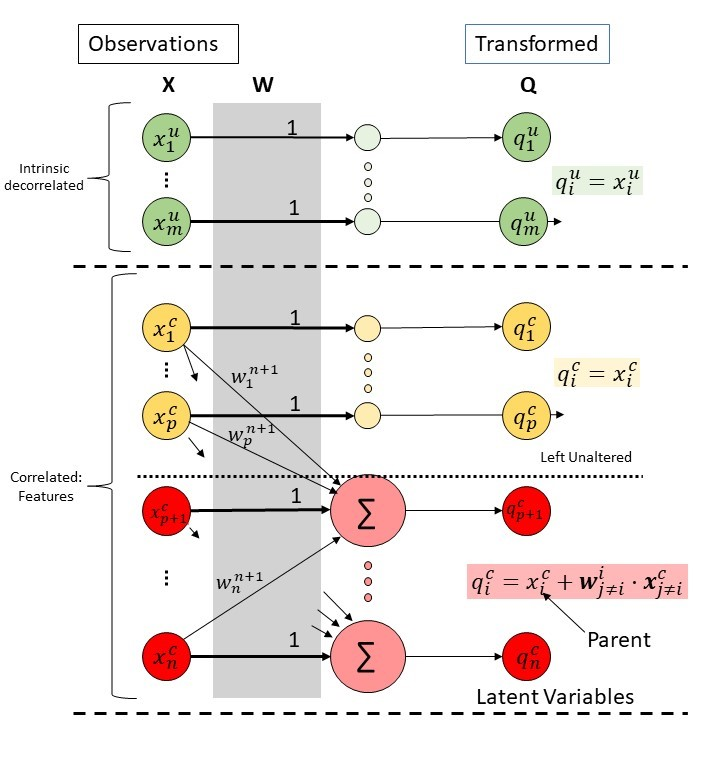

```{r setup, include=FALSE}
knitr::opts_chunk$set(echo = TRUE)
knitr::opts_chunk$set(collapse = TRUE, warning = FALSE, message = FALSE,comment = "#>")

pander::panderOptions('digits', 3)
pander::panderOptions('keep.trailing.zeros',TRUE)
op <- par(no.readonly = TRUE)

```

# Introduction



Iterative Linear Association Analysis (ILAA) is a computational method
that estimates the Exploratory Residualizatio Transform (ERT), an
special case of the UPLTM as seen in Figure 1. The ERT is estimated from
a sample of multidimensional data. ERT mitigates muticollinearity issues
via variable residualizatoin. The returned transformation matrix can be
used to:

1.  Do exploratory analysis of latent variables and their association to
    the observed variables

2.  Do exploratory discovery of latent variables associated with an
    specific outcome-target

3.  Addressing multicollinearity issues in linear regression models

    1.  Better estimation and interpretation of model variables

    2.  Improve linear model performance

4.  Simplify the multidimensional search space for many ML algorithms

The objective of this tutorial is to guide users in using the ILAA to
effectively accomplish the aforementioned tasks. The tutorial will
showcase:

-   Transform a data frame affected by data multicollinearity into a new
    a data frame with a maximum degree of data correlation among
    variables

-   Visualize the transformation matrix

-   Explore the returned formulas for each one of the returned latent
    variables

-   Understand and interpret the returned latent variables

-   Use ILAA as a pre-processing step to model a specific target outcome
    using linear models

    -   Explore the model in the transformed space
    -   Get the observed variables coefficients.

## The Libraries

ILAA is a wrapper of the more general method of data decorrelation
algorithm (IDeA) implemented in R, and both are part of the FRESA.CAD
3.4.6 package.

```{r}
## From git hub
#First install package devtools
#library(devtools)
#install_github("joseTamezPena/FRESA.CAD")

## For ILAA
library("FRESA.CAD")

## For network analysis
library(igraph)

## For multicollinearity
library(multiColl)
library(car)
library("colorRamps")

```

# Test Data

For this tutorial I'll use the body-fat prediction data set. The data
was downloaded from Kaggle:

<https://www.kaggle.com/datasets/fedesoriano/body-fat-prediction-dataset>

The Kaggle data disclaimer:

"Source The data were generously supplied by Dr. A. Garth Fisher who
gave permission to freely distribute the data and use for non-commercial
purposes.

Roger W. Johnson Department of Mathematics & Computer Science South
Dakota School of Mines & Technology 501 East St. Joseph Street Rapid
City, SD 57701

email address:
[rwjohnso\@silver.sdsmt.edu](mailto:rwjohnso@silver.sdsmt.edu){.email}
web address: <http://silver.sdsmt.edu/~rwjohnso>"

## Loading the Data

The BodyFat dataset contains the density information, a not direct
measurement. In this tutorial, we will remove the density and we will
try to model the body fat based on antrophometry.

The following code snippet loads the data and removes the density
information from the data. It also computes the Body Mass Index (BMI)

```{r}
body_fat <- read.csv("~/GitHub/LatentBiomarkers/Data/BodyFat/BodyFat.csv", header=TRUE)

### Removing density as estimator
body_fat$Density <- NULL

body_fat$BMI <- 10000*body_fat$Weight*0.453592/((body_fat$Height*2.54)^2)
## Removing subjects with data errors
body_fat <- body_fat[body_fat$BMI<=50,]
```

### The Heatmap of the Raw Data

Now, here we show the heatmap of the dataframe:

```{r results = "asis", warning = FALSE, dpi=300, fig.height= 5.0, fig.width= 7.0}

bkcolors <-seq(-2.5, 2.5, by = 0.5)
smap <- FRESAScale(body_fat,method="OrderLogit")$scaledData
  hm <- gplots::heatmap.2(scale(as.matrix(smap)),
                    trace = "none",
                    mar = c(5,5),
                    col=rev(colorRamps::matlab.like(length(bkcolors)-1)),
                    breaks = bkcolors,
                    main = "Raw Correlation",
                    cexRow = 0.15,
                    cexCol = 1.00,
                     srtCol=30,
                     srtRow=0,
                    key.title=NA,
                    key.xlab="Z",
                    xlab="Feature", ylab="Sample")
  par(op)

```

# ILAA Unsupervised Processing

The ILLA function is defined as follows:

``` r
 decorrelatedData <- ILAA(data=NULL,
                          thr=0.80,
                          method=c("pearson","spearman"),
                          Outcome=NULL,
                          drivingFeatures=NULL,
                          maxLoops=100,
                          verbose=FALSE,
                          bootstrap=0
                          )
```

where:

-   `data`: The source data-frame

-   *`thr`* : The target correlation goal.

-   *`method`* : Defines the correlation measure

-   `Outcome` The name of the target variable, and it is required for
    supervised learning

-   `drivingFeatures` : Defines a set of variables that are aimed to be
    basis unaltered vectors

-   `maxLoops` : The maximum number of iterations cycles

-   `verbose` : Display the evolution of the algorithm.

-   `bootstrap` : The number of bootstrap estimations. (True bootstrap
    when n\>500, 5% bootstrap at n\<=500)

At return of the ILLA function is a decorrelated dataframe that shares
the same dimensions as the input dataframe. The dataframe has the
following attributes:

```         
RTM <- attr(decorrelatedData,"UPLTM") 
fscore <- attr(decorrelatedData,"fscore");
drivingFeatures <- attr(decorrelatedData,"drivingFeatures");
adjustedpvalue <- attr(decorrelatedData,"unipvalue")
RCritical <- attr(decorrelatedData,"R.critical")
EvolutionData <- attr(decorrelatedData,"IDeAEvolution")
VarRatio <- attr(decorrelatedData,"VarRatio")
```

Attributes details:

-   `UPLTM`: The UPLTM matrix that can be used to decorrelated or
    analyze variables associations

-   `fscore`: A numeric vector with the final feature score of each
    analyzed variable. The fscore contains the number of times a
    variable was used as an independent variable minus the times it was
    a dependent variable.

-   `drivingFeatures` : The ordered character vector indicating the
    hierarchy of the variables for tiebreak

-   `unipvalue` : The adjusted p-values used to define a true
    variable-to-variable association inside the linear modeling

-   `R.critical` : The pearson R critical value used to filter-out false
    association between variables.

-   `IDeAEvolution` : A list with two elements:

    -   `Corr`: The evolution of the maximum observed correlation.

    -   `Spar`: The evolution of the matrix sparcity.

-   `VarRatio` : A vector indicating the ratio of the observed variance
    explained by the latent variable model.

## ILLA Auxiliary Functions

FRESA.CAD provide the following auxiliary functions:

``` r
newTransformedData   <- predictDecorrelate(decorrelatedData,NewData)
theBetaCoefficientts <- getLatentCoefficients(decorrelatedData)
fromLatenttoObserved <- getObservedCoef(decorrelatedData,latentModel)
```

-   `predictDecorrelate()` Rotates any new data set based on the output
    of an `ILAA` transformed data set.

-   `getLatentCoefficients()` Returns a list of all the beta
    coefficients for each one of the discovered latent variables. The
    attribute: "LatentCharFormulas" returns a list of the character
    string of the corresponding latent variable formula.

-   `getObservedCoef()` returns the beta coefficients on the observed
    space of any linear model that was trained on the UPLTM space.

## Sample Usage

By default, the ILAA function will target a correlation lower than 0.8
using the Pearson correlation measure. But user has the freedom to chose
between robust fitting with Spearman correlation measure, and/or set the
level of feature association by lowering the threshold. The following
snippet shows the different options.

```{r results = "asis", warning = FALSE}

# Default call
body_fat_Decorrelated <- ILAA(body_fat)
pander::pander(attr(body_fat_Decorrelated,"VarRatio"))

# Explore the convergence metrics in verbose mode
body_fat_Decorrelated <- ILAA(body_fat,verbose=TRUE)
pander::pander(attr(body_fat_Decorrelated,"VarRatio"))

# Robust Linear Fitting with the Spearman correlation measure
body_fat_Decorrelated <- ILAA(body_fat,method="spearman",verbose=TRUE)
pander::pander(attr(body_fat_Decorrelated,"VarRatio"))

# Lowering the threshold
body_fat_Decorrelated <- ILAA(body_fat,thr=0.4,verbose=TRUE)
pander::pander(attr(body_fat_Decorrelated,"VarRatio"))

# Tring to achive the maximum independence beteeen variables, i.e., thr=0.0
body_fat_Decorrelated <- ILAA(body_fat,thr=0.0,verbose=TRUE)
pander::pander(attr(body_fat_Decorrelated,"VarRatio"))

```

For the rest of the tutorial I'll set the correlation goal to 0.2 in
verbose mode.

```{r results = "asis", warning = FALSE, dpi=300, fig.height= 5.0, fig.width= 7.0}

# Calling ILAA to achieve a final correlation of 0.2
body_fat_Decorrelated <- ILAA(body_fat,thr=0.2,verbose=TRUE)
pander::pander(attr(body_fat_Decorrelated,"VarRatio"))


```

## The Heatmap of the Transformed Data

Here we review the transformed data using a heatmap of the data

```{r results = "asis", warning = FALSE, dpi=300, fig.height= 5.0, fig.width= 7.0}
smap <- FRESAScale(body_fat_Decorrelated,method="OrderLogit")$scaledData
  hm <- gplots::heatmap.2(scale(as.matrix(smap)),
                    trace = "none",
                    mar = c(5,5),
                    col=rev(colorRamps::matlab.like(length(bkcolors)-1)),
                    breaks = bkcolors,
                    main = "After ILAA Correlation",
                    cexRow = 0.15,
                    cexCol = 1.00,
                     srtCol=30,
                     srtRow=0,
                    key.title=NA,
                    key.xlab="Z",
                    xlab="Feature", ylab="Sample")
  par(op)

```

## Data Frame Attributes

The returned data matrix contains the following attributes

``` r
  attr(body_fat_Decorrelated,"UPLTM")            #The transformation matrix
  attr(body_fat_Decorrelated,"fscore")           #The score of each feature
  attr(body_fat_Decorrelated,"drivingFeatures")  #The list of driving features
  attr(body_fat_Decorrelated,"R.critical")       #The estimated minimum achieviable correlation
  attr(body_fat_Decorrelated,"IDeAEvolution")    #Evolution of the algorithm
  attr(body_fat_Decorrelated,"VarRatio")         #Variance Ratios: var(Latent)/Var(obs)
```

The main attributes is "`UPLTM`". That stores the specific linear
transformation matrix from observed variables to the latent variable.

The next relevant attribute is the "`VarRatio"`, this attributive stores
the fraction of the original feature variance that is still present in
the latent variable. All non-altered variables return a"`VarRatio`" of
1.

The "`IDeAEvolution`" attribute can be used to verify if the algorithm
achieved the target correlation goal, and the sparsity of the returned
matrix.

## Plotting the Evolution

Here we will use the `attr(dataTransformed,"IDeAEvolution")` to plot the
evolution of the correlation measure and the evolution of the matrix
sparsity.

```{r results = "asis", warning = FALSE, dpi=300, fig.height= 3.5, fig.width= 7.0}
par(mfrow=c(1,2),cex=0.5)

# Correlation
yval <- attr(body_fat_Decorrelated,"IDeAEvolution")$Corr
xidx <- c(1:length(yval))
plot(xidx,yval,
     xlab="Iteration Cycle",
     ylab="Max. Pearson Correlation",
     ylim=c(0,1.0),
     main="Evolution of the maximum Correlation")
  lfit <-try(loess(yval~xidx,span=0.5));
  if (!inherits(lfit,"try-error"))
  {
    plx <- try(predict(lfit,se=TRUE))
    if (!inherits(plx,"try-error"))
    {
      lines(xidx,plx$fit,lty=1,col="red")
    }
  }

# Sparsity  
yval <- attr(body_fat_Decorrelated,"IDeAEvolution")$Spar

plot(xidx,yval,
     xlab="Iteration Cycle",
     ylab="Matrix Sparcity",
     ylim=c(0,1.0),
     main="Evolution of the Matrix Sparcity")
  lfit <-try(loess(yval~xidx,span=0.5));
  if (!inherits(lfit,"try-error"))
  {
    plx <- try(predict(lfit,se=TRUE))
    if (!inherits(plx,"try-error"))
    {
      lines(xidx,plx$fit,lty=1,col="red")
    }
  }

```

## The ILAA Transformed Data

Before exploring into more detail, the properties of the `ILAA` results.
Let us first verify that the returned matrix does not contain features
with very high correlation among them.

Here I'll plot the original correlation and the correlation of the
returned data set.

```{r results = "asis", warning = FALSE, dpi=300, fig.height= 5.0, fig.width= 7.0}

# The original
  par(cex=0.6,cex.main=0.85,cex.axis=0.7)
  cormat <- cor(body_fat,method="pearson")
  gplots::heatmap.2(abs(cormat),
                    trace = "none",
                    mar = c(5,5),
                    col=rev(heat.colors(11)),
                    main = "Original Correlation",
                    cexRow = 0.75,
                    cexCol = 0.75,
                     srtCol=30,
                     srtRow=60,
                    key.title=NA,
                    key.xlab="|Pearson Correlation|",
                    xlab="Feature", ylab="Feature")

# The transformed
  cormat <- cor(body_fat_Decorrelated,method="pearson")
  gplots::heatmap.2(abs(cormat),
                    trace = "none",
                    mar = c(5,5),
                    col=rev(heat.colors(11)),
                    main = "Correlation After ILAA",
                    cexRow = 0.75,
                    cexCol = 0.75,
                     srtCol=30,
                     srtRow=60,
                    key.title=NA,
                    key.xlab="|Pearson Correlation|",
                    xlab="Feature", ylab="Feature")

```

## Exploring the Transformation

The `attr(body_fat_Decorrelated,"UPLTM")` returns the transformation
matrix. The `UPLTM` is sparse, here I show a heat map of the
transformation matrix that shows which elements are different from zero.

```{r results = "asis", warning = FALSE, dpi=300, fig.height= 5.0, fig.width= 7.0}

  UPLTM <- attr(body_fat_Decorrelated,"UPLTM")
  
  gplots::heatmap.2(1.0*(abs(UPLTM)>0),
                    trace = "none",
                    mar = c(5,5),
                    col=rev(heat.colors(2)),
                    Rowv=NULL,
                    Colv="Rowv",
                    dendrogram="none",
                    main = "Transformation matrix",
                    cexRow = 0.75,
                    cexCol = 0.75,
                   srtCol=30,
                   srtRow=60,
                    key.title=NA,
                    key.xlab="|Beta|>0",
                    xlab="Output Feature", ylab="Input Feature")
  
```

## The Latent Formulas

The sparsity of the `UPLTM` matrix can be analyzed to get the formula
for each one of the latent formulas. The `getLatentCoefficients()` and
its attribute: `attr(LatentFormulas,"LatentCharFormulas")` can be used
to display the formula of the latent variables.

```{r results = "asis", warning = FALSE, dpi=300, fig.height= 5.0, fig.width= 7.0}
# Get a list with the latent formulas' coefficients
LatentFormulas <- getLatentCoefficients(body_fat_Decorrelated)

# A string character with the formulas can be obtained by:
charFormulas <- attr(LatentFormulas,"LatentCharFormulas")
pander::pander(as.matrix(charFormulas))

```

## Latent Variable Interpretation

The ILAA returns the Unit Preserving Linear Transformation Matrix
(UPLTM). This specific transformation is the combination of
statistically significant linear association analysis between feature
pairs. Each significant association is modeled by a linear equation;
henceforth, the interpretation of each feature is as follows:

-   Each discovered latent variable is the residual of the observed
    parent variable *vs.* the suitable model of the variables associated
    with the parent variable. For example: $$
    LaWrist= Wrist - 0.012Weight - 0.165Neck.  
    $$

    Describes that the $Wrist$ is associated with the $Weight$ and
    $Neck$. The latent variable $LaWrist$ is the amount of information
    in the $Wrist$ not found by $Weight$ nor the $Neck$.

-   Therefore, the model of the $Wrist$ is :

$$
Wrist = +0.012Weight + 0.165Neck + b_o,  
$$

where $b_o$ is the bias term. It can be estimated using the difference
beteen the raw observations and the mean of the model.

## The Formula Network

The `graph_from_adjacency_matrix()` function from `igraph` can be used
to visualize the association between variables.

```{r results = "asis", warning = FALSE, dpi=300, fig.height= 5.0, fig.width= 7.0}
par(op)

transform <- attr(body_fat_Decorrelated,"UPLTM") != 0
colnames(transform) <- str_remove_all(colnames(transform),"La_")
transform <- abs(transform*cor(body_fat[,rownames(transform)])) # The weights are proportional to the observed correlation


VertexSize <- attr(body_fat_Decorrelated,"fscore") # The size depends on the variable independence relevance (fscore)
names(VertexSize) <- str_remove_all(names(VertexSize),"La_")
VertexSize <- 10*(VertexSize-min(VertexSize))/(max(VertexSize)-min(VertexSize)) # Normalization


gr <- graph_from_adjacency_matrix(transform,mode = "directed",diag = FALSE,weighted=TRUE)
gr$layout <- layout_with_fr

# The user can use any cluster method. Here we use the optimal clustering.
fc <- cluster_optimal(gr)
plot(fc, gr,
     edge.width=2*E(gr)$weight,
     edge.arrow.size=0.5,
     edge.arrow.width=0.5,
     vertex.size=VertexSize,
     vertex.label.cex=0.85,
     vertex.label.dist=2,
     main="Feature Association")
par(op)


```

### ILAA Solution is Data Dependent

I'll generate 100 solutions of the UPLTM and aggregate the non-zero
coefficients. Then, I'll plot the heat map of the frequency of hits.

Each estimation will be done using a bootstrapped sample from the
original data set.

```{r results = "asis", warning = FALSE, dpi=300, fig.height= 5.0, fig.width= 7.0}
par(op)

dsize <- nrow(body_fat);
taccmatrix <- cor(body_fat)*0;
for (lp in c(1:100))
{
  dmat <- ILAA(body_fat[sample(dsize,dsize,replace = TRUE),],thr=0.2)
  transform <- attr(dmat,"UPLTM") != 0 
  colnames(transform) <- str_remove_all(colnames(transform),"La_")
  taccmatrix[,colnames(transform)] <- taccmatrix[,colnames(transform)] + transform
}

gplots::heatmap.2(taccmatrix,
                    trace = "none",
                    mar = c(5,5),
                    Rowv=NULL,
                    Colv="Rowv",
                    dendrogram="none",
                    col=rev(heat.colors(11)),
                    main = "Transform Hits",
                    cexRow = 0.75,
                    cexCol = 0.75,
                   srtCol=30,
                   srtRow=60,
                    key.title=NA,
                    key.xlab="|Beta|>0",
                    xlab="Output Feature", ylab="Input Feature")

  par(op)
  
```

### Bootstrapping ILLA

To handle the data sensitivity to the input data, ILAA allows for
bootstrapping estimation of the transformation matrix.

```{r results = "asis", warning = FALSE, dpi=300, fig.height= 5.0, fig.width= 7.0}

## Here we petrubate only 5% of the data
body_fat_Decorrelated <-  ILAA(body_fat,thr=0.2,verbose=TRUE,bootstrap=100)


pander::pander(attr(body_fat_Decorrelated,"VarRatio"))

## Getting the formulas
LatentFormulas <- getLatentCoefficients(body_fat_Decorrelated)
charFormulas <- attr(LatentFormulas,"LatentCharFormulas")
pander::pander(as.matrix(charFormulas))


## The transformation
par(op)

transform <- attr(body_fat_Decorrelated,"UPLTM") != 0 # The non-zero coefficients
colnames(transform) <- str_remove_all(colnames(transform),"La_")  # For network analysis
transform <- abs(transform*cor(body_fat[,rownames(transform)])) # The weights are proportional to the observed correlation


gplots::heatmap.2(transform,
                    trace = "none",
                    mar = c(5,5),
                    Rowv=NULL,
                    Colv="Rowv",
                    dendrogram="none",
                    col=rev(heat.colors(11)),
                    main = "(Transform <> 0)*Correlation",
                    cexRow = 0.75,
                    cexCol = 0.75,
                   srtCol=30,
                   srtRow=60,
                    key.title=NA,
                    key.xlab="|R|",
                    xlab="Output Feature", ylab="Input Feature")

  par(op)


## Network analysis
# The vertex size will be proportional to the fscore of the IDeA procedure.
  
VertexSize <- attr(body_fat_Decorrelated,"fscore") # The size depends on the variable independence relevance (fscore)
VertexSize <- 10*(VertexSize-min(VertexSize))/(max(VertexSize)-min(VertexSize)) # Normalization


gr <- graph_from_adjacency_matrix(transform,mode = "directed",diag = FALSE,weighted=TRUE)
gr$layout <- layout_with_fr

fc <- cluster_optimal(gr)
plot(fc, gr,
     edge.width=2*E(gr)$weight,
     edge.arrow.size=0.5,
     edge.arrow.width=0.5,
     vertex.size=VertexSize,
     vertex.label.cex=0.85,
     vertex.label.dist=2,
     main="Bootstrap: Feature Association")
par(op)

## Here we plot the final degree of correlation among output features
  cormat <- cor(body_fat_Decorrelated,method="pearson")
  gplots::heatmap.2(abs(cormat),
                    trace = "none",
                    mar = c(5,5),
                    col=rev(heat.colors(11)),
                    main = "Correlation After ILAA",
                    cexRow = 0.75,
                    cexCol = 0.75,
                     srtCol=30,
                     srtRow=60,
                    key.title=NA,
                    key.xlab="|Pearson Correlation|",
                    xlab="Feature", ylab="Feature")

par(op)
diag(cormat) <- 0
pander::pander(max(abs(cormat)))

```

#### Association Plots

The following code shows the association of the latent variable to each
one of the observed parent variable, and the association of the parent
variables to its linear model. For this example I will use the
`"VarRatio"` to rank the latent variables from the ones that keep the
most original variance to the latent variable with the minimum fraction.

```{r results = "asis", warning = FALSE, dpi=300, fig.height= 3.5, fig.width= 7.0}


par(mfrow=c(1,2),cex=0.45)
fnames <- names(charFormulas)[1]
## Sort by explanined variace
varratio <- attr(body_fat_Decorrelated,"VarRatio")
varratio <- varratio[names(varratio) %in% names(charFormulas)]

## Ploting

for (fnames in names(varratio))
{
  print(fnames)
  obsname <- str_remove(fnames,"La_")
  menv <- mean(body_fat_Decorrelated[,fnames])
  range <- max(body_fat[,obsname])-min(body_fat[,obsname])
  ylim <- c(menv-range/2,menv+range/2)
  xvals <- c(min(body_fat[,obsname]),max(body_fat[,obsname]))
  plot(body_fat[,obsname],
       body_fat_Decorrelated[,fnames],
       ylim=ylim,
       ylab=fnames,
       xlab=obsname,
       main=paste("ILAA Latent Variable:",fnames))

  lmtvals <- lm(body_fat_Decorrelated[,fnames]~body_fat[,obsname])
  pred <- lmtvals$coefficients[1] + lmtvals$coefficients[2] * xvals
  lines(x=xvals,y=pred,col="red")
  text(xvals[1]+(xvals[2]-xvals[1])/2,0.95*(ylim[2]-ylim[1])+ylim[1],sprintf("Slope= %.2f",lmtvals$coefficients[2]))

  
    
  deformula <- LatentFormulas[[fnames]]
  noInames <- names(deformula)[names(deformula) != obsname]
  predObs <- -(as.matrix(body_fat[,noInames]) %*% deformula[noInames])
  xvals <- c(min(predObs),max(predObs))
  plot(predObs,
       body_fat[,obsname],
       ylab=obsname,
       xlab=paste("Model:",obsname),
       main=paste("ILAA Generated Predictions of",obsname)
       )
  
  lmtvals <- lm(body_fat[,obsname]~predObs)
  pred <- lmtvals$coefficients[1] + lmtvals$coefficients[2] * xvals
  lines(x=xvals,y=pred,col="red")
  ylim <- c(min(body_fat[,obsname]),max(body_fat[,obsname]))

  text(xvals[1]+(xvals[2]-xvals[1])/2,0.95*(ylim[2]-ylim[1])+ylim[1],sprintf("Slope= %.2f",lmtvals$coefficients[2]))

}

par(op)

```

The visual inspection of the above-displayed figures shows that some
latent variables are not associated with the original parent variable,
but their model is fully correlated to the observed parent variable. A
clear example is The last plot in the above figure.

### Direct Transform Estimation

It is also possible to estimate the observation using the transformation
matrix. For this just set the diagonal of the transformation to zero,
the the output is the estimated observation from the independent
variables. In this example I also estimated the bias.

```{r results = "asis", warning = FALSE, dpi=300, fig.height= 3.5, fig.width= 7}
transform <- attr(body_fat_Decorrelated,"UPLTM")
# Set the diagonal to zero
diag(transform) <- 0

#Estimating the observation
obsestim <- -1*as.data.frame(as.matrix(body_fat[,rownames(transform)]) %*% transform)

#Bias estimation
bias <- apply(body_fat[,rownames(transform)],2,mean) - apply(obsestim[,colnames(transform)],2,mean)

#Plotting
par(mfrow=c(1,2),cex=0.45)
for (vn in names(varratio))
{
  oname <- str_remove_all(vn,"La_")
  plot(obsestim[,vn] + bias[oname],body_fat[,oname],xlab=paste("Estimated:",oname),ylab=oname,main=oname)
  indx <- obsestim[,vn]+bias[oname]
  lmtvals <- lm(body_fat[,oname] ~ indx )
  xvals <- c(min(obsestim[,vn]+ bias[oname]),max(obsestim[,vn]+ bias[oname])) 
  pred <- lmtvals$coefficients[1] + lmtvals$coefficients[2] * xvals
  lines(x=xvals,y=pred,col="red")
  ylim <- c(min(body_fat[,oname]),max(body_fat[,oname]))

  text(xvals[1]+(xvals[2]-xvals[1])/2,0.95*(ylim[2]-ylim[1])+ylim[1],
       sprintf("Slope= %.2f, R2=%3.2f",lmtvals$coefficients[2],1.0-varratio[vn])
      )
}
par(op)

```

# ILAA for Supervised Learning

The rerecorded use of ILAA transformation in supervised learning is to
split the data into training and validation sets. Henceforth, the next
lines of code will split the data into training (75%) and testing (25%)

## Split into Training Testing Sets

```{r}

# 75% for training 25% for testing 
set.seed(2)
trainsamples <- sample(nrow(body_fat),3*nrow(body_fat)/4)

trainingset <- body_fat[trainsamples,]
testingset <- body_fat[-trainsamples,]

```

## Data Train Analysis and Prediction of the Test Set

By default, `ILAA()` transforms are blind to outcome associations. but
in supervised learning the user is free to specify a target outcome to
drive the shape of the transformation matrix. Outcome-driven
transformations try to keep unaltered features strongly associated with
the target.

The `predictDecorrelate()` function can be used to predict any new
dataset from an `ILAA` transformed object.

The next code snippet shows the process of transforming the training set
and then using the returned object to transform the testing set using
both outcome-blind and outcome-driven transformations.

```{r results = "asis", warning = FALSE, dpi=300, fig.height= 5.0, fig.width= 7.0}

## Outcome-blind
body_fat_Decorrelated_train <- ILAA(trainingset,
                                    thr=0.2,
                                    Outcome="BodyFat",
                                    verbose=TRUE)
pander::pander(attr(body_fat_Decorrelated_train,"drivingFeatures"))

body_fat_Decorrelated_test <- predictDecorrelate(body_fat_Decorrelated_train
                                                 ,testingset)

## Outcome-driven transformation
body_fat_Decorrelated_trainD <- ILAA(trainingset,
                                     thr=0.2,
                                     Outcome="BodyFat",
                                     drivingFeatures="BodyFat",
                                     verbose=TRUE)

pander::pander(attr(body_fat_Decorrelated_trainD,"drivingFeatures"))

body_fat_Decorrelated_testD <- predictDecorrelate(body_fat_Decorrelated_trainD
                                                  ,testingset)

```

## Train a Regression Model for Body Fat Prediction

Once we have a transformed training and testing set, we can proceed to
train a linear model of the body fat content. For this example we will
use the `LASSO_1SE()` function of the FRESA.CAD package to model the
$BodyFat$ using all the variables in the transformed training set.

```{r results = "asis", warning = FALSE, dpi=300, fig.height= 5.0, fig.width= 7.0}

## Outcome-Blind
modelBodyFatRaw <- LASSO_MIN(BodyFat~.,trainingset)
pander::pander(as.matrix(modelBodyFatRaw$coef),caption="Raw Coefficients")

## Outcome-Blind
modelBodyFat <- LASSO_MIN(BodyFat~.,body_fat_Decorrelated_train)
pander::pander(as.matrix(modelBodyFat$coef),caption="Outcome-Blind Coefficients")

## Outcome-Driven
modelBodyFatD <- LASSO_MIN(BodyFat~.,body_fat_Decorrelated_trainD)
pander::pander(as.matrix(modelBodyFatD$coef),caption="Outcome-Driven Coefficients")


```

The printed beta coefficients of the models show that the LASSO models
are different between the Outcome-driven and outcome-blind ILAA methods.

#### Muticollinear Analysis

Here we check the Variance inflation factor (VIF) on the train and
testing sets

```{r results = "asis", warning = FALSE, dpi=300, fig.height= 5.0, fig.width= 7.0}
frm <- paste("BodyFat~",str_flatten(modelBodyFatRaw$selectedfeatures," + "))

X <- model.matrix(formula(frm),trainingset);
mc <- multiCol(X)
vifd <- VIF(X)
vifx <-vif(lm(formula(frm),trainingset))
title("Raw Train VIF")

X <- model.matrix(formula(frm),testingset);
mc <- multiCol(X)
vifd <- VIF(X)
vifx <-vif(lm(formula(frm),testingset))
title("Raw Test VIF")


frm <- paste("BodyFat~",str_flatten(modelBodyFat$selectedfeatures," + "))

X <- model.matrix(formula(frm),body_fat_Decorrelated_train);
mc <- multiCol(X)
vifd <- VIF(X)
vifx <-vif(lm(formula(frm),body_fat_Decorrelated_train))
title("Blind: Train VIF")

X <- model.matrix(formula(frm),body_fat_Decorrelated_test);
mc <- multiCol(X)
title("Blind: Test VIF")

frm <- paste("BodyFat~",str_flatten(modelBodyFatD$selectedfeatures," + "))
X <- model.matrix(formula(frm),body_fat_Decorrelated_trainD);
mc <- multiCol(X)
title("Driven: Train VIF")

X <- model.matrix(formula(frm),body_fat_Decorrelated_testD);

mc <- multiCol(X)
title("Driven: Test VIF")

```

The plots clearly indicate that both models do not have colinearity
issues

### The Model Coefficients in the Observed Space

The FRESA.CAD package provides a handy function, `getObservedCoef()`m to
get the linear beta coefficients from the transformed object. The next
code shows the procedure.

```{r  results = "asis", warning = FALSE}

# Get the coefficients in the observed space for the outcome-blind
observedCoef <- getObservedCoef(body_fat_Decorrelated_train,modelBodyFat)
pander::pander(as.matrix(observedCoef$coefficients),caption="Blind Coefficients")


# The outcome-driven coefficients
observedCoefD <- getObservedCoef(body_fat_Decorrelated_trainD,modelBodyFatD)
pander::pander(as.matrix(observedCoefD$coefficients),caption="Driven Coefficients")


```

#### Muticollinear Analysis on the observed space

Here we check the Variance inflation factor (VIF) on the train and
testing sets using the observed variables

```{r results = "asis", warning = FALSE, dpi=300, fig.height= 5.0, fig.width= 7.0}
X <- model.matrix(formula(observedCoef$formula),trainingset);
mc <- multiCol(X)
title("Observed Training VIF")

X <- model.matrix(formula(observedCoef$formula),testingset);
mc <- multiCol(X)
title("Observed Testing VIF")

X <- model.matrix(formula(observedCoefD$formula),trainingset);
mc <- multiCol(X)
title("Driven: Observed Training VIF")

X <- model.matrix(formula(observedCoefD$formula),testingset);
mc <- multiCol(X)
title("Driven: Observed Testing VIF")

```

The results indicate that the models created using the observed
variables have strong collinearity issues.

### Predict Using the Transformed Data-Set

The user can predict the BodyFat content using the handy `predict()`
function. After that we can measure the testing performance using the
`predictionStats_regression()` function.

```{r results = "asis", warning = FALSE, dpi=300, fig.height= 5.0, fig.width= 7.0}

## OUtcome-Blind 
predicBodyFat <- predict(modelBodyFat,body_fat_Decorrelated_test)
rmetrics <- predictionStats_regression(cbind(testingset$BodyFat,
                                             predicBodyFat),
                                       "Body Fat: Blind")
pander::pander(rmetrics)

## Outcome-Driven
predicBodyFatD <- predict(modelBodyFatD,body_fat_Decorrelated_testD)
rmetrics <- predictionStats_regression(cbind(testingset$BodyFat,
                                             predicBodyFatD),
                                       "Body Fat: Driven")
pander::pander(rmetrics)

```

The reported metrics indicated that the model predictions are highly
correlated to the real $BodyFat$

### Prediction Using the Observed Features

An ILAA user has the option to predict the $BodyFat$ content from the
observed testing set using the computed beta coefficients. The next
lines of code show how to do the prediction using `model.matrix()` R
function and the dot product `%*%` :

```{r results = "asis", warning = FALSE, dpi=300, fig.height= 5.0, fig.width= 7.0}


predicBodyFatObst <- model.matrix(formula(observedCoef$formula),testingset) %*% observedCoef$coefficients

plot(predicBodyFatObst,
     predicBodyFat,
     xlab="Observed Space",
     ylab="Transformed Space",
     main="Test Predictions: Observed vs. Transformed")

```

The last plot shows the expected result: that both predictions are
identical.

### Comparison to Raw Model

A last experiment is to compare the differences between a LASSO model
created from the observed features to the model created from the
transformed observations.

The next lines of code compute the linear model using LASSO from the
original observed data. Then, it computes the predicted performance.

```{r results = "asis", warning = FALSE, dpi=300, fig.height= 5.0, fig.width= 7.0}
rawmodelBodyFat <- LASSO_1SE(BodyFat~.,trainingset)
pander::pander(rawmodelBodyFat$coef)

rawpredicBodyFat <- predict(rawmodelBodyFat,testingset)
rmetrics <- predictionStats_regression(cbind(testingset$BodyFat,
                                             rawpredicBodyFat),"Raw: Body Fat")
pander::pander(rmetrics)

```

The evaluation of the testing results indicates that the observed model
predictions have a correlation of 0.875. Slightly superior, but not
statistically significant, to the one observed from the model estimated
from the transformed space: ( $\rho _t=0.863$ vs. $\rho _o=0.875$ )

### Comparing the Feature Significance on the Models

The main advantage of the ILAA transformation is that the returned
latent variables are not colinear hence the statistical significance of
the beta coefficients are not affected by multicolinearity. The next
code snippet shows how to get the beta coefficients using the `lm()` ,
and `summary.lm()` functions.

The inspection of the summary results clearly shows that most of the
beta coefficients on the transformed data set are significant.

```{r results = "asis", warning = FALSE, dpi=300, fig.height= 5.0, fig.width= 7.0}

## Raw Model
par(mfrow=c(2,2),cex=0.5)
rawlm <- lm(BodyFat~.,
            trainingset[,c("BodyFat",names(rawmodelBodyFat$coef)[-1])])
pander::pander(rawlm,add.significance.stars=TRUE)
plot(rawlm)

## Outcome-Blind
par(mfrow=c(2,2),cex=0.5)
Delm <- lm(BodyFat~.,body_fat_Decorrelated_train[,c("BodyFat",names(modelBodyFat$coef)[-1])])
pander::pander(Delm,add.significance.stars=TRUE)
plot(Delm)

## Outcome-Driven
par(mfrow=c(2,2),cex=0.5)
Delm <- lm(BodyFat~.,
           body_fat_Decorrelated_trainD[,c("BodyFat",names(modelBodyFatD$coef)[-1])])
pander::pander(Delm,add.significance.stars=TRUE)
plot(Delm)

par(op)
```

## Train a Logistic Model for Overweight Prediction

This last experiment showcases the effect of data transformation on
logistic modeling. This experiment starts by creating a data-frame that
does not includes the $BMI$, $Height$, and $Weight$ variables. The
target outcome is to identify if the person is Overweight or normal.
(BMI\>=25). The next lines of code compute the new data frames and
remove the above mentioned variables.

### Data Conditioning

First Remove Height and Weight from Training and Testing Sets

```{r results = "asis",}

trainingsetBMI <- trainingset[,!(colnames(trainingset) %in% c("Weight","Height"))]
testingsetBMI <- testingset[,!(colnames(trainingset) %in% c("Weight","Height"))]
trainingsetBMI$Overweight <- 1*(trainingsetBMI$BMI>=25)
testingsetBMI$Overweight <- 1*(testingsetBMI$BMI>=25)
trainingsetBMI$BMI <- NULL
testingsetBMI$BMI <- NULL

# The number of subjects
pander::pander(table(trainingsetBMI$Overweight),caption="Training Distribution")
pander::pander(table(testingsetBMI$Overweight),caption="Testing Distribution")

## The outcome-blind transformation
OW_Decorrelated_train <- ILAA(trainingsetBMI,
                              thr=0.2,
                              Outcome="Overweight",
                              verbose=TRUE)

OW_Decorrelated_test <- predictDecorrelate(OW_Decorrelated_train,testingsetBMI)

## The outcome-driven transformation

OW_Decorrelated_trainD <- ILAA(trainingsetBMI,
                               thr=0.2,
                               Outcome="Overweight",
                               drivingFeatures="Overweight",
                               verbose=TRUE)

OW_Decorrelated_testD <- predictDecorrelate(OW_Decorrelated_trainD,testingsetBMI)


```

The last code snippet transforms the observed features using ILLA and
setting a target variable and setting the convergence not to be affected
by the target outcome.

### The Logistic Model

LASSO_1SE with a binomial family is used to compute the logistic model
of overweight.

```{r results = "asis", warning = FALSE, dpi=300, fig.height= 5.0, fig.width= 7.0}

## Outcome-blind
modelOverweight <- LASSO_1SE(Overweight~.,
                             OW_Decorrelated_train,
                             family="binomial")
pander::pander(as.matrix(modelOverweight$coef),caption="Training: Blind")

## Outcome-driven
modelOverweightD <- LASSO_1SE(Overweight~.,
                              OW_Decorrelated_trainD,
                              family="binomial")
pander::pander(as.matrix(modelOverweightD$coef),caption="Training: Driven")

```

### The Model Coefficients in the Observed Space

Once the logistic model is created in the transformed space, we can
compute the beta coefficients for each one of the observed variables.

```{r  results = "asis", warning = FALSE}

# Get the coefficients in the observed space
observedCoef <- getObservedCoef(OW_Decorrelated_train,modelOverweight)
pander::pander(as.matrix(observedCoef$coefficients),caption="Observed Coefficients")


```

### Predict Using the Transformed Data Set

The predictions of the testing set can be done using the handy
`predict()` function. The evaluation of the testing results can be
evaluated using the `predictionStats_binary()` function.

```{r results = "asis", warning = FALSE, dpi=300, fig.height= 5.0, fig.width= 7.0}

## Outcome-blind
predicOverweight <- predict(modelOverweight,OW_Decorrelated_test)
pr <- predictionStats_binary(cbind(OW_Decorrelated_test$Overweight,
                                   predicOverweight),"Overweight: Blind")
pander::pander(pr$ClassMetrics)

## Outcome-Driven
predicOverweightD <- predict(modelOverweightD,OW_Decorrelated_testD)
pr <- predictionStats_binary(cbind(OW_Decorrelated_test$Overweight,
                                   predicOverweightD),"Overweight: Driven")
pander::pander(pr$ClassMetrics)

```

### Prediction Using the Observed Features

The predict of the testing set can be done using the `model.matrix()`
and the dot product `%*%.`

```{r results = "asis", warning = FALSE, dpi=300, fig.height= 5.0, fig.width= 7.0}

predicOverweightObst <- model.matrix(formula(observedCoef$formula),testingsetBMI) %*% observedCoef$coefficients
#predicOverweightObst <- 1.0/(1.0 + exp(-predicOverweightObst));

plot(predicOverweightObst,predicOverweight,
     xlab="Observed",
     ylab="Transformed",
     main="Test predictions: Observed vs. Transformed")

```

The last plot shows the expected result: both predictions are identical.

### Comparison to Raw Model

To showcase the advantage of transformed modeling *vs.* raw modeling,
here I'll estimate the logistic model from the observed variables and
contrast to the model generated from the transformed space.

The next lines of code compute the logistic model and display its
testing performance:

```{r results = "asis", warning = FALSE, dpi=300, fig.height= 5.0, fig.width= 7.0}
##Training
rawmodelOverweight <- LASSO_1SE(Overweight~.,
                                trainingsetBMI,
                                family="binomial")
pander::pander(rawmodelOverweight$coef)
## Predict
rawpredicOverweight <- predict(rawmodelOverweight,testingsetBMI)
pr <- predictionStats_binary(cbind(testingsetBMI$Overweight,
                                   rawpredicOverweight),"Overweight")
pander::pander(pr$ClassMetrics)

```

The model created from the observed data has an ROC AUC that is not
statistically significant to the transformed model

### Comparing the Feature Significance on the Models

This last lines of code will compute the significance of the beta
coefficients for both the observed model and the latent-based model. The
user can clearly see that all the betas of the latent-based model are
statically significant. An effect that is not seen in the logistic
observed model.

```{r results = "asis", warning = FALSE, dpi=300, fig.height= 5.0, fig.width= 7.0}

par(mfrow=c(2,2),cex=0.5)

## Raw model
rawlm <- lm(Overweight~.,trainingsetBMI[,c("Overweight",names(rawmodelOverweight$coef)[-1])])
pander::pander(rawlm,add.significance.stars=TRUE)
plot(rawlm)

## Outcome-blind
par(mfrow=c(2,2),cex=0.5)
Delm <- lm(Overweight~.,OW_Decorrelated_test[,c("Overweight",names(modelOverweight$coef)[-1])])
pander::pander(Delm,add.significance.stars=TRUE)
plot(Delm)


## Outcome-Driven
par(mfrow=c(2,2),cex=0.5)
Delm <- lm(Overweight~.,OW_Decorrelated_testD[,c("Overweight",names(modelOverweightD$coef)[-1])])
pander::pander(Delm,add.significance.stars=TRUE)
plot(Delm)

```

# Conclusion

In conclusion, ILAA (Iterative Linear Association Analysis), stands as
an unsupervised computer-based methodology adept at estimating linear
transformation matrices. These matrices enable the conversion of
datasets into a fresh latent-based space, offering a user-controlled
degree of correlation. This report has effectively demonstrated the
practical application of ILAA, providing comprehensive insights into its
functions for estimating, predicting, and scrutinizing transformations.
Such capabilities hold significant promise in supervised learning
scenarios, encompassing regression and logistic models.
